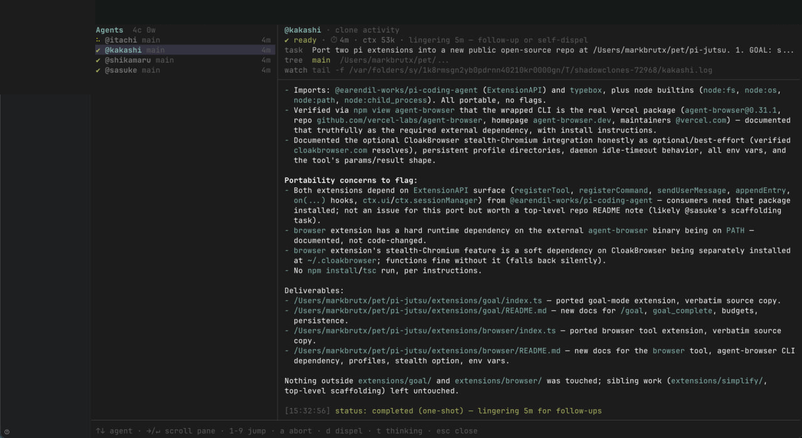
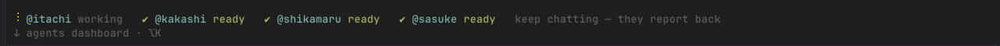

# pi-jutsu

Techniques for the pi coding agent.

[pi](https://github.com/earendil-works/pi) is a minimal, extensible coding agent for the terminal. pi-jutsu is a curated collection of extensions for it, built and hardened through daily use. The flagship extension runs Naruto-style shadow-clone agent swarms — hence the name (jutsu: technique).

## Extensions

| Extension | What it does |
|-----------|--------------|
| [swarm](extensions/swarm/) | Persistent shadow-clone subagents plus parallel one-shot workers, with a live TUI dashboard and per-clone model tiers. |
| [goal](extensions/goal/) | Autonomous goal mode: the agent keeps iterating until it verifiably completes the goal, under token and time budgets. |
| [browser](extensions/browser/) | Browser control through stealth Chromium via the `agent-browser` CLI, with persistent profiles. |
| [simplify](extensions/simplify/) | Three parallel review subagents over your changed code: reuse, quality, and efficiency. |



The swarm dashboard, mid-flight: four shadow clones porting this very repository into the open. The tray keeps clone status visible while you keep chatting:



## Install

Clone the repo:

```bash
git clone https://github.com/markbrutx/pi-jutsu.git
```

Register the extensions you want in `~/.pi/agent/settings.json`:

```json
{
  "extensions": [
    "/path/to/pi-jutsu/extensions/swarm",
    "/path/to/pi-jutsu/extensions/goal",
    "/path/to/pi-jutsu/extensions/browser",
    "/path/to/pi-jutsu/extensions/simplify"
  ]
}
```

Or load one for a single session:

```bash
pi -e /path/to/pi-jutsu/extensions/swarm
```

Each extension's README covers its own configuration and requirements.

## Why

These extensions come out of daily production use of agentic coding, not demos. They encode multi-agent orchestration patterns that hold up under real workloads: a lead/clone hierarchy with steering interrupts, memory distillation across sessions, and model tiering — an expensive architect model for open-ended thinking, a cheap executor model for mechanical work.

## License

[MIT](LICENSE)
